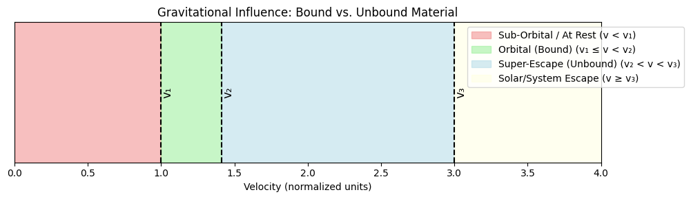

# Problem 2
Below is a comprehensive Markdown document that explains the concepts of escape and cosmic velocities, walks through the derivations and calculations for Earth, Mars, and Jupiter, and includes both a Python simulation for plotting the velocities as well as a Java code snippet for an animation to be used in a presentation.

---

# Escape Velocities and Cosmic Velocities

## Introduction

Escape and cosmic velocities are fundamental in understanding the energy requirements for space travel. In celestial mechanics, three key velocity thresholds are defined:

- **First Cosmic Velocity:** The minimum speed needed for a circular orbit around a celestial body.
- **Second Cosmic Velocity:** The speed required to break free from the gravitational influence of that body.
- **Third Cosmic Velocity:** The speed necessary to overcome the gravitational pull of an entire star system (e.g., leaving the Solar System).

These concepts are critical when launching satellites, planning interplanetary missions, and even for envisaging potential interstellar travel.

## Definitions and Mathematical Derivations

### First Cosmic Velocity (Orbital Velocity)
- **Definition:** The minimum speed an object must have to enter a stable, circular orbit just above the surface of a planet.
- **Formula:**  
  $$v_1 = \sqrt{\frac{GM}{R}}$$
  
  where:
  - $G$ is the gravitational constant,
  - $M$ is the mass of the celestial body,
  - $R$ is its radius.

This expression comes from setting the gravitational force equal to the required centripetal force for circular motion.

### Second Cosmic Velocity (Escape Velocity)
- **Definition:** The minimum speed required for an object to escape the gravitational pull of a celestial body without further propulsion.
- **Formula:**  
  
  $$v_2 = \sqrt{\frac{2GM}{R}} = \sqrt{2}\,v_1  $$

  
It is derived by equating the object’s kinetic energy to the gravitational potential energy (with the condition that the total energy is zero at infinity).

### Third Cosmic Velocity (Interplanetary Escape Velocity)
- **Definition:** The velocity required to leave the gravitational influence of the star system from a planet’s orbit.
- **Formula:**  
  
  $$v_{esc,\odot} = \sqrt{\frac{2GM_\odot}{r}}$$
  
  where:
  - $M_\odot$ is the mass (or, more precisely, the gravitational parameter) of the Sun,
  - $r$ is the distance from the Sun.

This threshold indicates the additional energy required for a spacecraft to escape the solar gravitational field, once it has already overcome the planet’s pull.

## Calculations for Different Celestial Bodies

For our calculations, we use typical values for three celestial bodies:

- **Earth:**  
  - Mass, $M_{\text{Earth}} = 5.972 \times 10^{24}\,\text{kg}$  
  - Radius, $R_{\text{Earth}} = 6.371 \times 10^6\,\text{m}$
  
- **Mars:**  
  - Mass, $M_{\text{Mars}} \approx 6.39 \times 10^{23}\,\text{kg}$  
  - Radius, $R_{\text{Mars}} \approx 3.3895 \times 10^6\,\text{m}$
  
- **Jupiter:**  
  - Mass, $M_{\text{Jupiter}} \approx 1.898 \times 10^{27}\,\text{kg}$  
  - Radius, $R_{\text{Jupiter}} \approx 6.9911 \times 10^7\,\text{m}$

In addition, to compute the third cosmic velocity, we use the Sun’s gravitational parameter $GM_\odot \approx 1.327 \times 10^{20}\,\text{m}^3/\text{s}^2$ and the average distances from the Sun:
- Earth: $1.496 \times 10^{11}\,\text{m}$
- Mars: Approximately $2.279 \times 10^{11}\,\text{m}$
- Jupiter: Approximately $7.785 \times 10^{11}\,\text{m}$

Using the formulas:
- **First cosmic velocity:**  
  $\displaystyle v_1 = \sqrt{\frac{GM}{R}}$
- **Second cosmic velocity:**  
  $\displaystyle v_2 = \sqrt{2}\,v_1$
- **Third cosmic velocity (solar escape at orbit):**  
  $\displaystyle v_3 = \sqrt{\frac{2GM_\odot}{r}}$

we can compare these velocities for the different bodies.

## Python Simulation for Visualization

The following Python script calculates the three velocities for Earth, Mars, and Jupiter and visualizes them using a bar chart.

```python
import numpy as np
import matplotlib.pyplot as plt

# Constants
G = 6.67430e-11  # gravitational constant in m^3 kg^-1 s^-2
GM_sun = 1.32712440018e20  # Sun's gravitational parameter in m^3/s^2

# Celestial bodies parameters
bodies = {
    'Earth': {'mass': 5.972e24, 'radius': 6.371e6, 'distance_sun': 1.496e11},
    'Mars':  {'mass': 6.39e23,  'radius': 3.3895e6, 'distance_sun': 2.279e11},
    'Jupiter': {'mass': 1.898e27, 'radius': 6.9911e7, 'distance_sun': 7.785e11}
}

# Compute velocities (in m/s)
results = {}
for body, params in bodies.items():
    M = params['mass']
    R = params['radius']
    r_sun = params['distance_sun']
    
    v1 = np.sqrt(G * M / R)  # first cosmic velocity (orbital)
    v2 = np.sqrt(2) * v1     # second cosmic velocity (escape)
    v3 = np.sqrt(2 * GM_sun / r_sun)  # third cosmic velocity (solar escape at orbit)
    
    # Convert velocities to km/s for readability
    results[body] = {'v1': v1/1000, 'v2': v2/1000, 'v3': v3/1000}

# Print the computed values
for body, vals in results.items():
    print(f"{body}: First = {vals['v1']:.2f} km/s, Second = {vals['v2']:.2f} km/s, Third = {vals['v3']:.2f} km/s")

# Plotting the velocities
bodies_list = list(results.keys())
v1_values = [results[b]['v1'] for b in bodies_list]
v2_values = [results[b]['v2'] for b in bodies_list]
v3_values = [results[b]['v3'] for b in bodies_list]

x = np.arange(len(bodies_list))
width = 0.25

fig, ax = plt.subplots(figsize=(10, 6))
ax.bar(x - width, v1_values, width, label='First Cosmic Velocity')
ax.bar(x, v2_values, width, label='Second Cosmic Velocity')
ax.bar(x + width, v3_values, width, label='Third Cosmic Velocity (Solar)')

ax.set_ylabel('Velocity (km/s)')
ax.set_title('Cosmic Velocities for Earth, Mars, and Jupiter')
ax.set_xticks(x)
ax.set_xticklabels(bodies_list)
ax.legend()

plt.show()
```

When you run this script, it prints the velocity values and displays a bar chart comparing the three velocities for each celestial body.

## Java Animation Script for Presentation

The following Java code snippet creates a simple animation using Swing. The animation simulates a rocket attempting to escape a planet’s gravity, visually illustrating the concept of escape velocity.

```java
import javax.swing.*;
import java.awt.*;
import java.awt.event.ActionEvent;
import java.awt.event.ActionListener;

public class EscapeVelocityAnimation extends JPanel implements ActionListener {
    private Timer timer;
    private double rocketY = 300; // initial Y position of the rocket
    private double velocity = -5; // initial upward velocity (negative indicates upward movement)
    private final double gravity = 0.1; // constant acceleration due to gravity

    public EscapeVelocityAnimation() {
        timer = new Timer(20, this);
        timer.start();
    }

    @Override
    protected void paintComponent(Graphics g) {
        super.paintComponent(g);
        // Draw the planet as a blue circle near the bottom
        g.setColor(Color.BLUE);
        g.fillOval(100, 350, 200, 200);

        // Draw the rocket as a red rectangle
        g.setColor(Color.RED);
        g.fillRect(190, (int) rocketY, 20, 40);

        // Display the current velocity
        g.setColor(Color.BLACK);
        g.drawString("Velocity: " + String.format("%.2f", velocity) + " units", 10, 20);
    }

    @Override
    public void actionPerformed(ActionEvent e) {
        // Update rocket's position and velocity
        rocketY += velocity;
        velocity += gravity; // gravity decelerates the rocket upward, then accelerates it downward

        // Reset the animation once the rocket "lands" again
        if (rocketY > 350) {
            rocketY = 300;
            velocity = -5;
        }
        repaint();
    }

    public static void main(String[] args) {
        JFrame frame = new JFrame("Escape Velocity Animation");
        EscapeVelocityAnimation animation = new EscapeVelocityAnimation();
        frame.add(animation);
        frame.setSize(400, 600);
        frame.setDefaultCloseOperation(JFrame.EXIT_ON_CLOSE);
        frame.setVisible(true);
    }
}
```

Compile and run this Java program to see a simple animation that conceptually demonstrates the rocket’s ascent and the effect of gravity—key to understanding the idea behind escape velocities.

## Importance in Space Exploration

- **Satellite Launches:**  
  Achieving the first cosmic velocity allows satellites to maintain stable orbits for communication, weather monitoring, and scientific observation.
  
- **Interplanetary Missions:**  
  Overcoming the second cosmic velocity is crucial for spacecraft to leave a planet’s gravitational influence, and the third cosmic velocity determines the additional energy required to leave the solar system.
  
- **Interstellar Travel:**  
  For future missions that aim to travel between stars, understanding and planning for these velocity thresholds is essential in designing propulsion systems and trajectories.

## Conclusion

By mathematically deriving and visually simulating the first, second, and third cosmic velocities, we can appreciate the physics behind orbital maneuvers and escape trajectories. These principles not only enhance our understanding of celestial mechanics but also form the backbone of modern space exploration technologies. Whether launching satellites or planning interplanetary journeys, the study of cosmic velocities remains a cornerstone in advancing our reach into space.

---

This visual representation helps clarify how material transitions from being gravitationally bound to unbound as its velocity increases. Feel free to run and modify the code to suit your presentation needs.
Feel free to use and adapt the provided Python and Java scripts for your simulations and presentations.