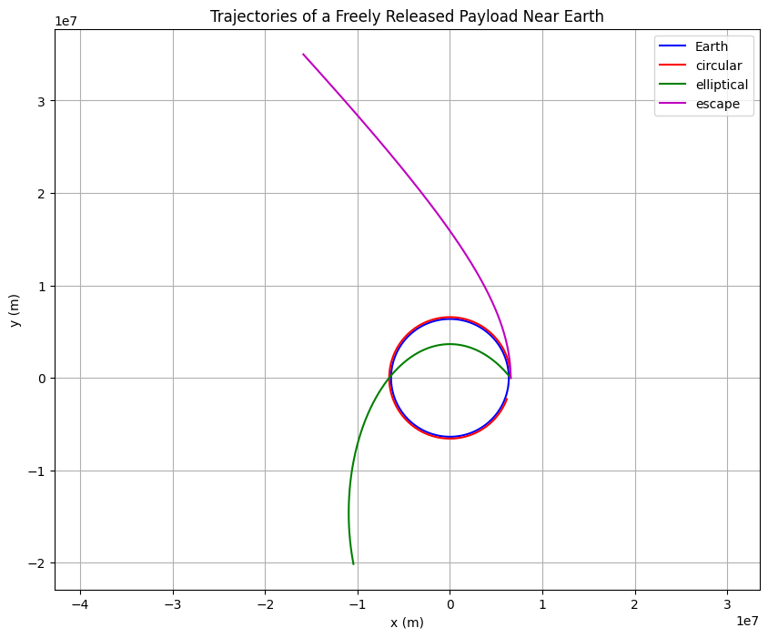
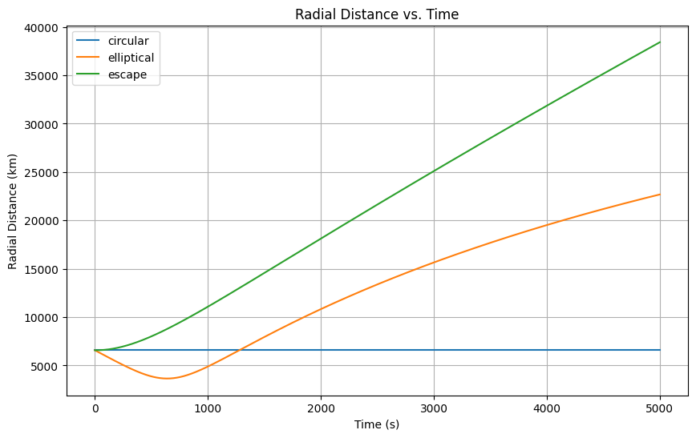
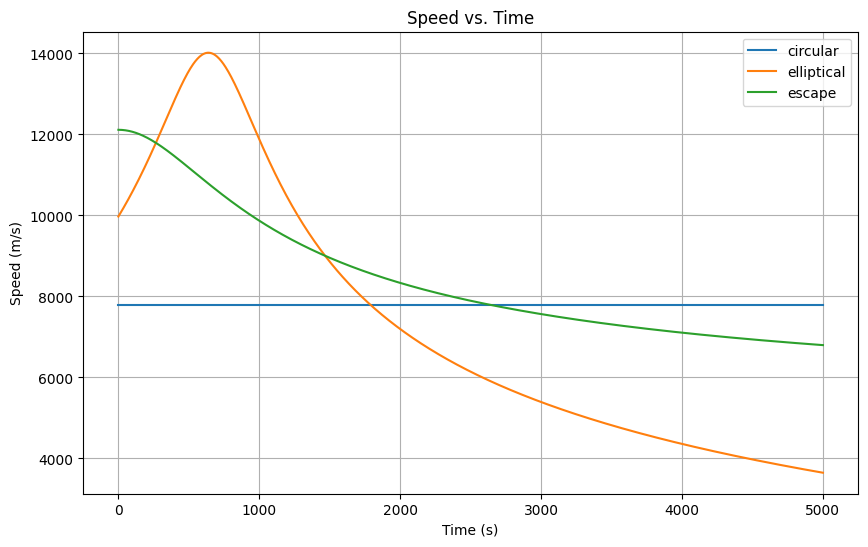
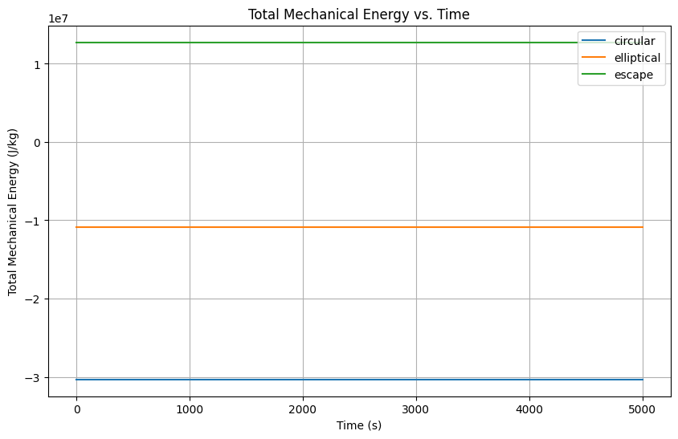

# Problem 3
Below is a comprehensive Markdown document that explains the physics behind the trajectories of a freely released payload near Earth and provides a Python simulation to explore different scenarios (elliptical/orbital, reentry, and escape). The document details the underlying gravitational dynamics, the numerical approach used, and includes code and plots to visualize the trajectories.

---

# Trajectories of a Freely Released Payload Near Earth

## Overview

When a payload is released from a moving rocket near Earth, its subsequent path is determined by the initial position, velocity, and the gravitational pull of the Earth. Depending on these factors, the payload may follow an elliptical (or circular), parabolic, or hyperbolic trajectory. Such analyses are crucial in space mission planning—whether for inserting satellites into orbit, planning safe reentry trajectories, or achieving escape conditions.

### Key Concepts

- **Newton’s Law of Gravitation:**  
  The gravitational acceleration is given by  

    $$\vec{a} = -\frac{GM}{r^3} \vec{r}$$
  
  where $G$ is the gravitational constant, $M$ is the mass of Earth, and $r$ is the distance from Earth’s center.

- **Orbital Velocities:**  
  - **Circular Orbit:** The velocity required for a stable circular orbit at a distance $r$ is  
    
    $$v_{\text{circular}} = \sqrt{\frac{GM}{r}}$$
    
  - **Escape Velocity:** The speed needed to break free from Earth’s gravitational influence is  
    
   $$ v_{\text{escape}} = \sqrt{\frac{2GM}{r}}$$
    

- **Trajectory Types:**
  - **Elliptical/Circular Orbits:** Occur when the payload’s speed is below escape velocity.
  - **Parabolic Trajectories:** Represent the exact threshold case for escape.
  - **Hyperbolic Trajectories:** Occur when the payload’s speed exceeds escape velocity.

---

## Simulation and Numerical Analysis

The simulation uses Python to solve the equations of motion numerically. We adopt the following steps:

1. **Define the Dynamics:**  
   The system’s state is represented as $ [x, y, v_x, v_y] $. The time evolution is governed by:
   $$ \frac{d}{dt}\begin{bmatrix} x \\ y \\ v_x \\ v_y \end{bmatrix} = \begin{bmatrix} v_x \\ v_y \\ -\frac{GMx}{r^3} \\ -\frac{GMy}{r^3} \end{bmatrix} $$
   
   

2. **Initial Conditions:**  
   We consider a payload released at an altitude of 200 km above Earth’s surface. Three scenarios are simulated:
   - **Circular Orbit:** Velocity set to the circular orbit speed.
   - **Elliptical Orbit:** A lower tangential velocity leading to an elliptical path (which may lead to reentry).
   - **Escape Trajectory:** A speed greater than the escape velocity to produce a hyperbolic path.

3. **Numerical Integration:**  
   We use a solver (e.g., `solve_ivp` from SciPy) to integrate the motion over a specified time interval.

4. **Visualization:**  
   The trajectories are plotted with Earth shown as a circle.

---

## Python Code Implementation

Below is the complete Python code that implements the simulation:

```python
import numpy as np
import matplotlib.pyplot as plt
from scipy.integrate import solve_ivp

# Constants
G = 6.67430e-11        # gravitational constant [m^3 kg^-1 s^-2]
M_earth = 5.972e24     # mass of Earth [kg]
R_earth = 6371e3       # radius of Earth [m]

def payload_dynamics(t, state):
    """
    Computes the derivative of the state vector for the payload.
    
    Parameters:
        t (float): Time variable (not used explicitly as the problem is time-invariant).
        state (list or np.array): [x, y, vx, vy] current state of the payload.
    
    Returns:
        list: Derivatives [vx, vy, ax, ay]
    """
    x, y, vx, vy = state
    r = np.sqrt(x**2 + y**2)
    # Gravitational acceleration components
    ax = -G * M_earth * x / r**3
    ay = -G * M_earth * y / r**3
    return [vx, vy, ax, ay]

# Simulation parameters
initial_altitude = 200e3  # altitude above Earth's surface in meters
initial_r = R_earth + initial_altitude

# Calculate velocities for different scenarios
v_circular = np.sqrt(G * M_earth / initial_r)
v_escape = np.sqrt(2 * G * M_earth / initial_r)

# Define initial conditions for different trajectories:
# Format: [x, y, vx, vy]
initial_conditions = {
    'circular': [initial_r, 0, 0, v_circular],
    'elliptical': [initial_r, 0, -0.8*v_circular, v_circular],
    'escape': [initial_r, 0, 0, 1.1*v_escape]
}

# Time span for the simulation (in seconds)
t_span = (0, 5000)
t_eval = np.linspace(t_span[0], t_span[1], 1000)

# Prepare the plot
plt.figure(figsize=(10, 8))

# Plot Earth as a circle
theta = np.linspace(0, 2*np.pi, 1000)
x_earth = R_earth * np.cos(theta)
y_earth = R_earth * np.sin(theta)
plt.plot(x_earth, y_earth, 'b', label='Earth')

# Colors for different trajectories
colors = {'circular': 'r', 'elliptical': 'g', 'escape': 'm'}

# Numerical integration for each case
for traj, ic in initial_conditions.items():
    sol = solve_ivp(payload_dynamics, t_span, ic, t_eval=t_eval, rtol=1e-8)
    plt.plot(sol.y[0], sol.y[1], color=colors[traj], label=traj)

plt.xlabel("x (m)")
plt.ylabel("y (m)")
plt.title("Trajectories of a Freely Released Payload Near Earth")
plt.legend()
plt.axis('equal')
plt.grid(True)
plt.show()
```

---

## Explanation of the Code

1. **Defining the Dynamics:**  
   The `payload_dynamics` function computes the state derivatives using the gravitational force. The acceleration is inversely proportional to $r^2$ (with the $r^3$ term ensuring directionality).

2. **Setting Initial Conditions:**  
   - The payload starts at an altitude of 200 km above the surface.
   - Three different initial velocity conditions are defined:
     - **Circular:** Velocity equals $v_{\text{circular}}$ in the perpendicular direction.
     - **Elliptical:** Velocity slightly reduced to induce an elliptical orbit.
     - **Escape:** Velocity exceeds the escape speed, leading to a hyperbolic path.

3. **Numerical Integration:**  
   We use `solve_ivp` to integrate the equations over 5000 seconds, capturing the trajectory at 1000 time steps.

4. **Visualization:**  
   The plot shows Earth (as a blue circle) and the three trajectories in different colors (red for circular, green for elliptical, and magenta for escape).

---

## Discussion

- **Orbital Insertion (Circular/Elliptical):**  
  When the payload is given the correct tangential velocity, it enters a stable circular orbit. A reduction in speed (elliptical case) results in an orbit with a lower perigee, potentially leading to reentry if the perigee is below Earth's atmosphere.

- **Escape Scenario:**  
  If the payload's velocity exceeds the escape velocity, its path will be open (hyperbolic trajectory) meaning it will eventually leave Earth's gravitational influence.

- **Applications:**  
  This simulation is fundamental in designing maneuvers for satellite deployments, planning safe reentry trajectories, and executing missions where escape trajectories are required (e.g., interplanetary travel).




---

This document provides both the theoretical framework and practical implementation to analyze the trajectories of a payload released near Earth. Feel free to adjust the initial conditions or extend the simulation further for more complex scenarios.

