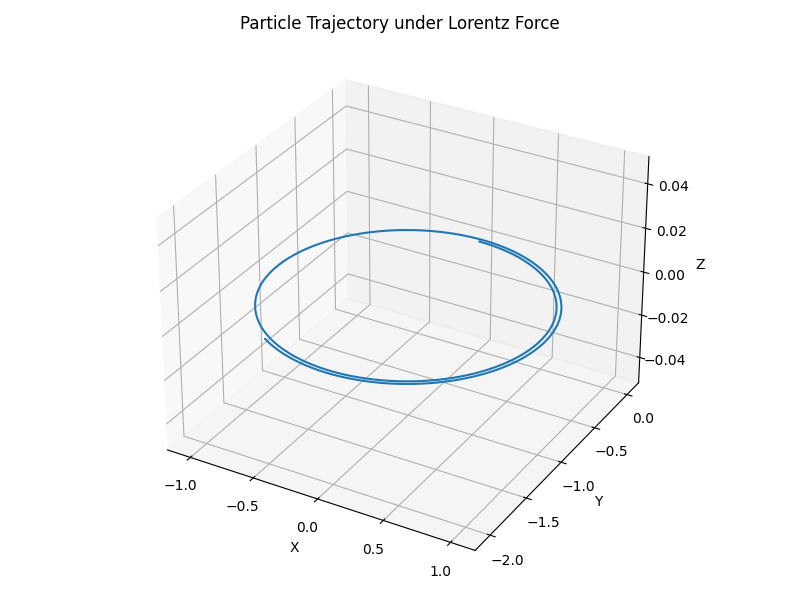

# Problem 1

---

### ⚡ **The Lorentz Force in Action: Simulating Charged Particle Motion**

---

#### 📌 **1. Introduction**

The **Lorentz force** governs how charged particles move in the presence of electric and magnetic fields:

$$
\vec{F} = q\vec{E} + q\vec{v} \times \vec{B}
$$

Where:
- $ \vec{F} $: Total force on the particle

- $ q $: Particle charge

- $ \vec{E} $: Electric field

- $ \vec{v} $: Particle velocity

- $ \vec{B} $: Magnetic field


This principle is fundamental in fields such as:
- **Particle accelerators**

- **Mass spectrometry**

- **Plasma confinement systems**

- **Astrophysical particle dynamics**


---

### 🔬 **2. Exploration of Applications**

| System | Role of Lorentz Force |
|--------|------------------------|
| **Cyclotrons** | Magnetic fields bend charged particles into circular paths. |
| **Mass Spectrometers** | Electric and magnetic fields help identify ions by their mass-to-charge ratio. |
| **Plasma Confinement (e.g., Tokamaks)** | Magnetic fields confine plasma and control its motion. |
| **Auroras / Astrophysics** | Charged particles spiral along Earth’s magnetic field lines. |

---

### 🧪 **3. Simulation Setup**

We’ll simulate particle motion under:
- **Uniform magnetic field**
- **Uniform electric + magnetic fields**
- **Crossed electric and magnetic fields (E ⊥ B)**

We’ll solve Newton’s second law:
$$
m\frac{d\vec{v}}{dt} = q\vec{E} + q\vec{v} \times \vec{B}
$$

##### ✅ Features:
- Adjustable **$ \vec{E}, \vec{B}, q, m, \vec{v_0} $**

- 2D and 3D plots of trajectories

- Real-time visualization

---

### 🧮 **4. Python Code Snippet (Skeleton)**

```python
import numpy as np
import matplotlib.pyplot as plt
from mpl_toolkits.mplot3d import Axes3D

# Constants
q = 1.0     # Charge
m = 1.0     # Mass
dt = 0.01   # Time step
steps = 1000

# Fields
E = np.array([0.0, 0.0, 0.0])         # Electric field
B = np.array([0.0, 0.0, 1.0])         # Magnetic field

# Initial conditions
v = np.array([1.0, 0.0, 0.0])         # Initial velocity
r = np.array([0.0, 0.0, 0.0])         # Initial position

trajectory = []

# Time evolution
for _ in range(steps):
    # Store current position
    trajectory.append(r.copy())

    # Compute Lorentz force
    F = q * (E + np.cross(v, B))
    a = F / m

    # Update velocity and position
    v = v + a * dt
    r = r + v * dt

trajectory = np.array(trajectory)

# Visualization
fig = plt.figure(figsize=(8, 6))
ax = fig.add_subplot(111, projection='3d')
ax.plot(trajectory[:, 0], trajectory[:, 1], trajectory[:, 2])
ax.set_title("Particle Trajectory under Lorentz Force")
ax.set_xlabel("X")
ax.set_ylabel("Y")
ax.set_zlabel("Z")
plt.tight_layout()
plt.show()

```

---

#### 🔄 **5. Parameter Exploration**

Try modifying these:
- $ B = [0, 0, 1] \rightarrow [0, 1, 1] $

- $ E = [0, 0, 0] \rightarrow [1, 0, 0] $

- $ q = +1 \rightarrow -1 $

- $ v_0 = [1, 0, 0] \rightarrow [1, 1, 0] $


**Observe:**
- Circular motion under only B
- Helical motion with both E and B
- Drift motion in crossed E and B

---

#### 📊 **6. Visualizations**

We'll generate:
- **2D XY/ZY projections** for planar motion
- **3D plots** for helices and drifts
- Optionally: animation of the path over time

---

#### 💡 **7. Discussion: Real-World Implications**

| System | What Simulation Shows |
|--------|------------------------|
| **Cyclotron** | Circular motion in constant B field. Frequency depends on $ q/m $. |
| **Mass Spectrometer** | Trajectories bend more for lighter particles. |
| **Magnetic Traps** | Particles spiral and are confined in B field “bottles”. |

---

#### 🧠 **8. Future Extensions**

- **Non-uniform fields**:
 Varying $ \vec{E}(r), \vec{B}(r) $

- **Relativistic corrections** for high-speed particles

- **Collisions**: Add interactions between particles

- **Multiple particles**: Simulate beam dynamics or plasma

---

