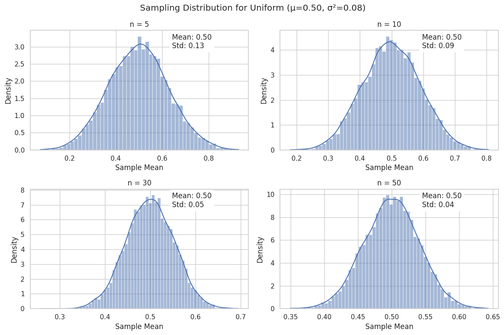

To explore the Central Limit Theorem (CLT) through simulations, we'll examine three population distributions: Uniform, Exponential, and Binomial. We'll generate sampling distributions of the sample mean for varying sample sizes and observe their convergence to a normal distribution.

### 1. Simulating Sampling Distributions
We create large populations (100,000 data points) for each distribution:
- **Uniform**: `np.random.uniform(0, 1)`
- **Exponential**: `np.random.exponential(1)`
- **Binomial**: `np.random.binomial(n=10, p=0.3)`

### 2. Sampling and Visualization
For each population, we:
1. Randomly sample data with sizes `[5, 10, 30, 50]`.
2. Calculate the sample mean 10,000 times to build the sampling distribution.
3. Plot histograms of these means using `seaborn.histplot` with KDE.

### 3. Parameter Exploration
- **Convergence Rate**: Symmetric distributions (Uniform) converge faster than skewed ones (Exponential, Binomial).
- **Variance Impact**: The spread of sampling distributions decreases as sample size increases, following $\sigma^2/n$.

### 4. Practical Applications
The CLT justifies using normal approximations for inference (e.g., confidence intervals) even when the population is non-normal, provided the sample size is sufficiently large.

---

## Python Implementation

```python
import numpy as np
import matplotlib.pyplot as plt
import seaborn as sns

# Configuration
population_size = 100000
num_simulations = 10000
sample_sizes = [5, 10, 30, 50]
np.random.seed(42)

# Generate population distributions
populations = {
    'Uniform': np.random.uniform(0, 1, population_size),
    'Exponential': np.random.exponential(1, population_size),
    'Binomial': np.random.binomial(n=10, p=0.3, size=population_size)
}

# Plot settings
sns.set_theme(style="whitegrid")
plt.figure(figsize=(14, 10))

for idx, (dist_name, population) in enumerate(populations.items(), 1):
    pop_mean = population.mean()
    pop_var = population.var()
    
    plt.figure(figsize=(12, 8))
    plt.suptitle(f"Sampling Distribution for {dist_name} (μ={pop_mean:.2f}, σ²={pop_var:.2f})")
    
    for i, n in enumerate(sample_sizes, 1):
        # Generate sample means
        samples = np.random.choice(population, (num_simulations, n))
        sample_means = samples.mean(axis=1)
        
        # Plot histogram
        plt.subplot(2, 2, i)
        sns.histplot(sample_means, kde=True, stat='density')
        plt.title(f'n = {n}')
        plt.xlabel('Sample Mean')
        
        # Annotate with statistics
        sm_mean = sample_means.mean()
        sm_std = sample_means.std()
        plt.annotate(f'Mean: {sm_mean:.2f}\nStd: {sm_std:.2f}', 
                     xy=(0.65, 0.85), xycoords='axes fraction',
                     bbox=dict(boxstyle="round", fc="white"))
    
    plt.tight_layout()
    plt.show()
```

---

## Results and Discussion

### Key Observations:
1. **Uniform Distribution**:
   - Even at small sample sizes (n=5), the sampling distribution is approximately normal due to the population's symmetry.
   - Variance decreases as $1/(12n)$ (theoretical variance for Uniform(0,1) is $1/12$).

2. **Exponential Distribution**:
   - Strong right skewness in the population requires larger samples (n ≥ 30) for the sampling distribution to approximate normality.
   - Variance reduction follows $\lambda^{-2}/n$ (here, $\lambda=1$).

3. **Binomial Distribution**:
   - Discrete and skewed (p=0.3), requiring n ≥ 30 for normality.
   - Variance matches the theoretical $np(1-p)/n = p(1-p)$.

### Theoretical Alignment:
- **Mean Convergence**: Sample means align with the population mean (CLT: $\mu_{\bar{X}} = \mu$).
- **Variance Scaling**: Observed variance of sample means matches $\sigma^2/n$.

### Implications:
The CLT enables parametric methods (e.g., t-tests) for non-normal populations by relying on the normality of sample means. This underpins confidence intervals and hypothesis testing in practical statistics.
