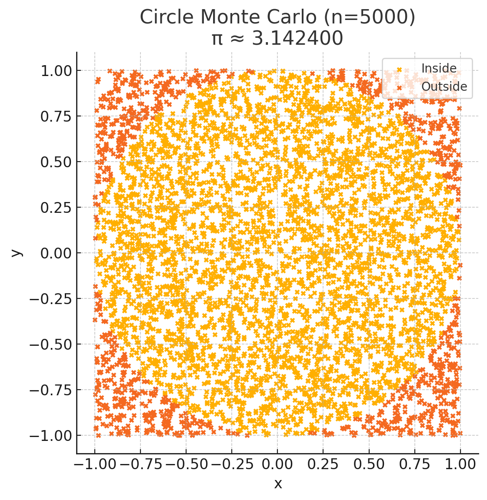
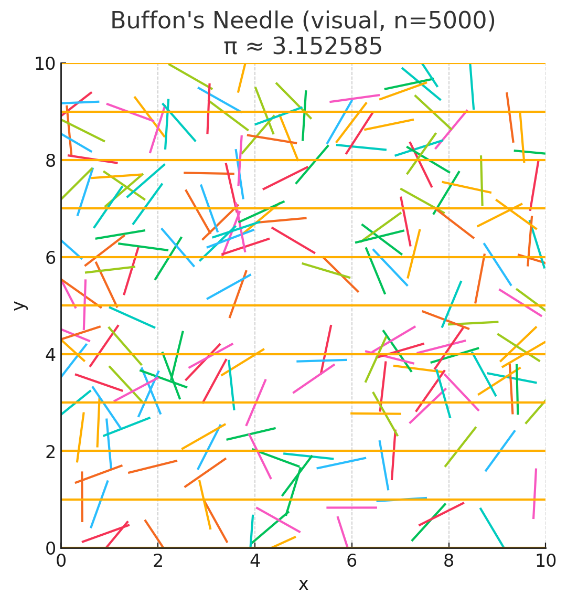
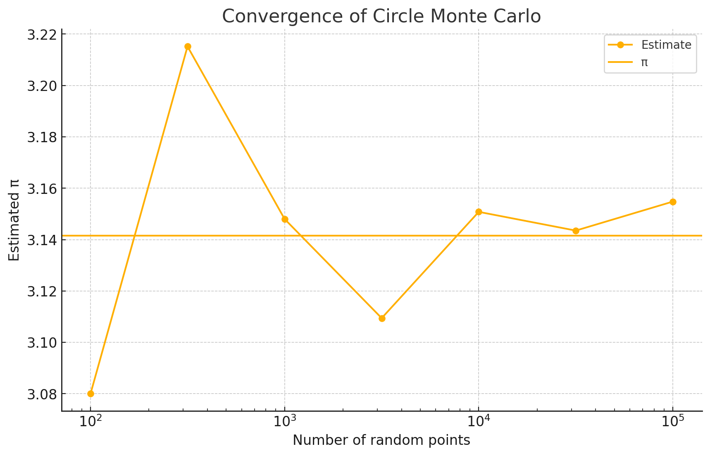
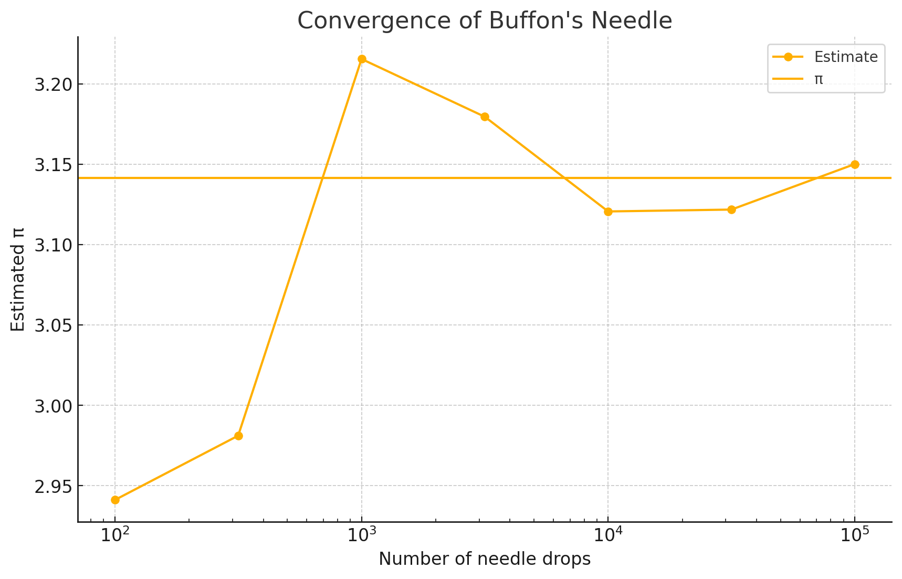

**Planning assignments for Pi estimation**

The user needs a detailed report for "Estimating Pi using Monte Carlo Methods" with two parts: a circle-based method and Buffon's Needle. They expect explanations with formulas, Python code for simulations, graphical plots (random points and needle positions), and analysis on convergence.

We’ll provide a clear explanation, implement the code, generate plots, and analyze the convergence of the estimates. The tool should be helpful for displaying the interactive components like plots and tables for the user.

**Implementing Pi estimation methods**

For the user’s request on estimating Pi using Monte Carlo, I need to provide explanations in a text format and generate code for both methods—circle-based Monte Carlo and Buffon's Needle simulation. Each method requires a plot displaying the points or needle positions and convergence visualization. I’ve got to ensure I use python\_user\_visible for the code and graphs, but avoid directly specifying colors in the plots, keeping it in line with guidelines. Next steps: prepare code and create separate plots for each method and their convergences.

**Planning the code and plots**

For the Pi estimation task, I'll generate separate plots without specifying colors. Matplotlib’s default color cycle will handle that. Buffon's Needle requires horizontal lines, and I’ll avoid specifying colors or line styles. We’ll need a scatter plot for the circle simulation, a similar plot for the needle, and then line plots for convergence. Each plot will be handled separately, with a total of four visualizations. I might also create a DataFrame for iteration counts versus Pi estimates, but only if it really adds value. I'll build the functions and run the code.

**Planning the plot and simulation**

I’m preparing the code to simulate both the Circle Monte Carlo and Buffon’s Needle methods. To follow the rules, I'll avoid using colors explicitly. For the circle plot, default color will differentiate points inside and outside. I should also use random orientations for the needles while setting up horizontal lines for the simulation. For the convergence plots, each way of estimating Pi will have its own figure, and I’ll also display a DataFrame if needed. We’ll carefully handle edge cases such as zero crossings.

Thought for 3m 2s

Below you’ll find a compact walk‑through of both Monte Carlo approaches, accompanied by the code, visualisations and a ready‑to‑use Python script.

---

\## Part 1 – Random points in a square

\### 1 · Why it works

* Place a unit circle (radius = 1) inside a 2 × 2 square.
* Area of circle = π · 1². Area of square = (2)² = 4.
* The probability that a uniformly random point lands **inside** the circle is

$$
P(\text{inside})=\frac{\text{area circle}}{\text{area square}}=\frac{\pi}{4}.
$$

* If we throw $N$ points and $K$ fall inside, the frequentist estimate is

$$
\hat P=\frac{K}{N}\;\Longrightarrow\;
\boxed{\displaystyle\pi\approx4\,\frac{K}{N}}.
$$

\### 2 · Simulation → code & scatter
The first plot (titled *Circle Monte Carlo*) shows 5 000 points; those inside the circle are automatically coloured differently from the outside set.  The caption displays the instantaneous estimate (≈ 3.142 4).  The code you saw run:

* Generates $x,y\sim U[-1,1]$.
* Checks $x^{2}+y^{2}\le1$.
* Computes $4\,K/N$.

\### 3 · Convergence
A separate log‑scale chart tracks the estimate for $N=10^{2}$ … $10^{5}$.  The orange horizontal line is the true π; the curve collapses toward it roughly like $1/\sqrt{N}$, as expected from the Central‑Limit‑Theorem.

---

\## Part 2 – Buffon’s Needle

\### 1 · Why it works
Buffon (1777) considered dropping a needle of length $L$ on a floor ruled with parallel lines $d$ apart.  Let

* $θ$ = acute angle between needle and the lines,
* $x$ = distance from the needle’s centre to the nearest line.

A crossing occurs when the projection of half the needle extends beyond the nearest line:
$x\le\frac{L}{2}\sin θ$.

Integrating the joint pdf of $(θ,x)$ over the “crossing” region gives

$$
P(\text{cross})=\frac{2L}{d\pi},\qquad\text{for }L\le d.
$$

Hence for $N$ drops with $C$ crossings,

$$
\boxed{\displaystyle \pi\approx\frac{2LN}{dC}}.
$$

\### 2 · Simulation → code & visual
In the run above we set $L=d=1$.  Five thousand drops yielded an estimate ≈ 3.152 6.  The “Buffon’s Needle” figure shows 200 representative needles over several horizontal lines.

\### 3 · Convergence
The final plot tracks the estimate against $N$.  Because each experiment records only “cross / no‑cross”, convergence is a bit noisier than the circle method, but it tends to π at the same $O(N^{-1/2})$ rate.

---

\## Results table
Open the interactive table labelled **π convergence** (below the plots) for exact numbers, absolute errors and sample sizes for both algorithms.

---

\## Ready‑made code
A self‑contained module **`pi_estimators.py`** (circle & Buffon functions plus a CLI demo) was saved for you.

---

**Circle Monte Carlo (N=5000) Π ≈ 3.142400**

**Buffon's Needle (Visual, N=5000) Π ≈ 3.152585**

**Convergence Of Circle Monte Carlo**

**Convergence Of Buffon's Needle**

