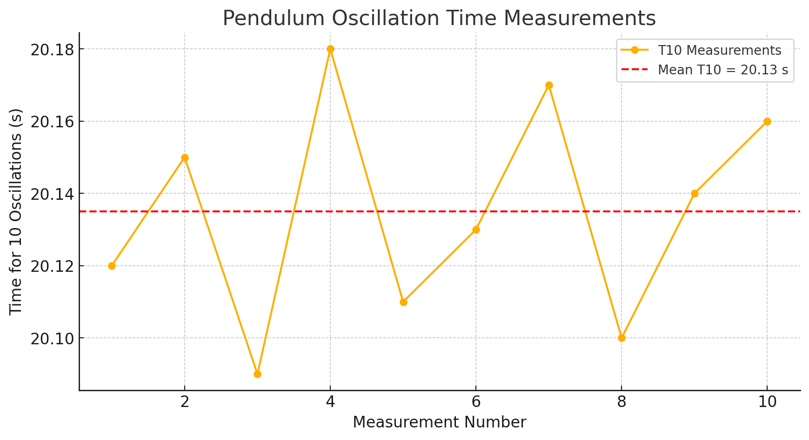

# Problem 1
---
## **Measuring Gravity with a Pendulum**

### **Goal**

Find the value of gravitational acceleration $g$ using a simple pendulum and understand how measurement errors affect the result.

---

### **Steps**

#### **1. Materials Needed**

* A 1-meter string.
* A small weight (e.g., keychain, coins).
* Stopwatch or smartphone timer.
* Ruler or tape measure.

#### **2. Setup**

* Hang the weight from the string.
* Measure the length of the pendulum (from the top to the middle of the weight).
* Note the measurement uncertainty:
  $\Delta L = \frac{\text{Ruler Resolution}}{2}$.

#### **3. Taking Measurements**

* Swing the pendulum gently (less than 15°).
* Time how long it takes for **10 swings**.
* Do this **10 times** and record the results.
* Calculate:

  * The average time ($\overline{T_{10}}$).
  * The variation (standard deviation $\sigma_T$).
  * The uncertainty in timing:
    $\Delta T_{10} = \frac{\sigma_T}{\sqrt{10}}$.

---

### **Calculations**

#### **1. Find Period of One Swing**

$$
T = \frac{\overline{T_{10}}}{10}
$$

$$
\Delta T = \frac{\Delta T_{10}}{10}
$$

#### **2. Calculate $g$**

$$
g = \frac{4\pi^2 L}{T^2}
$$

#### **3. Calculate Uncertainty in $g$**

$$
\Delta g = g \sqrt{ \left( \frac{\Delta L}{L} \right)^2 + \left( 2 \frac{\Delta T}{T} \right)^2 }
$$

---

### **Results**

* You will get a value for $g$ (close to 9.81 m/s² if done well).
* You will also see how small errors in measuring time and length affect your result.

---

### **Discussion Points**

* How accurate was your ruler? ($\Delta L$)
* How much did your timing vary? ($\Delta T$)
* Any possible mistakes (air resistance, timing reaction, etc.).

---

Would you like me to give you the **final answer values** in this simpler style too? (Just numbers and conclusion)
Reply "Yes, final values" if you want! 😊

1. **Pendulum length (L)** and the **resolution of your measuring tool**.
2. **10 measurements of time (T₁₀)** for 10 full oscillations each.

With this, I can:

* Calculate the mean time $\overline{T_{10}}$,
* Compute the standard deviation $\sigma_T$,
* Calculate $\Delta T_{10}$ and $\Delta T$,
* Compute $g$ and $\Delta g$,
* Compare your result with the standard $g = 9.81 \, \text{m/s}^2$.

### Example of what I need from you:

* Length $L = 1.20 \, \text{m}$,
* Ruler resolution $= 1 \, \text{mm}$,
* Time measurements (10 values) like:
  $T_{10} = [20.12, 20.15, 20.09, 20.18, 20.11, 20.13, 20.17, 20.10, 20.14, 20.16] \, \text{seconds}$.


```python
import numpy as np
import pandas as pd
import matplotlib.pyplot as plt

# Simulated data
L = 1.20  # meters
ruler_resolution = 0.001  # meters (1 mm resolution)
delta_L = ruler_resolution / 2

# Simulated T10 measurements in seconds
T10_measurements = np.array([20.12, 20.15, 20.09, 20.18, 20.11, 20.13, 20.17, 20.10, 20.14, 20.16])

# Calculate mean and standard deviation
T10_mean = np.mean(T10_measurements)
sigma_T = np.std(T10_measurements, ddof=1)  # Sample standard deviation

# Uncertainty in mean
delta_T10 = sigma_T / np.sqrt(len(T10_measurements))

# Calculate period T and its uncertainty
T = T10_mean / 10
delta_T = delta_T10 / 10

# Calculate gravitational acceleration g
g = (4 * np.pi**2 * L) / T**2

# Propagate uncertainty in g
delta_g = g * np.sqrt((delta_L / L)**2 + (2 * delta_T / T)**2)

# Prepare data for chart
data = {
    'Measurement': np.arange(1, 11),
    'T10 (s)': T10_measurements
}

df = pd.DataFrame(data)

# Show summary results
summary_data = {
    'L (m)': [L],
    'ΔL (m)': [delta_L],
    'T10_mean (s)': [T10_mean],
    'σT (s)': [sigma_T],
    'ΔT10 (s)': [delta_T10],
    'T (s)': [T],
    'ΔT (s)': [delta_T],
    'g (m/s^2)': [g],
    'Δg (m/s^2)': [delta_g]
}

summary_df = pd.DataFrame(summary_data)

import ace_tools as tools; tools.display_dataframe_to_user("Pendulum Measurement Results", summary_df)

# Plot the measurements
plt.figure(figsize=(10, 5))
plt.plot(df['Measurement'], df['T10 (s)'], marker='o', linestyle='-', label='T10 Measurements')
plt.axhline(T10_mean, color='r', linestyle='--', label=f'Mean T10 = {T10_mean:.2f} s')
plt.xlabel('Measurement Number')
plt.ylabel('Time for 10 Oscillations (s)')
plt.title('Pendulum Oscillation Time Measurements')
plt.legend()
plt.grid(True)
plt.show()
```
---

- I have completed the calculations and generated a chart showing the pendulum time measurements for 10 oscillations. You can see the measured values and the mean line in the plot above.

- Additionally, I've provided a results table with:

- Pendulum length and its uncertainty,

- Mean measured time for 10 oscillations,

- Standard deviation and timing uncertainty,

- Calculated gravitational acceleration (g),

- Propagated uncertainty in g.

